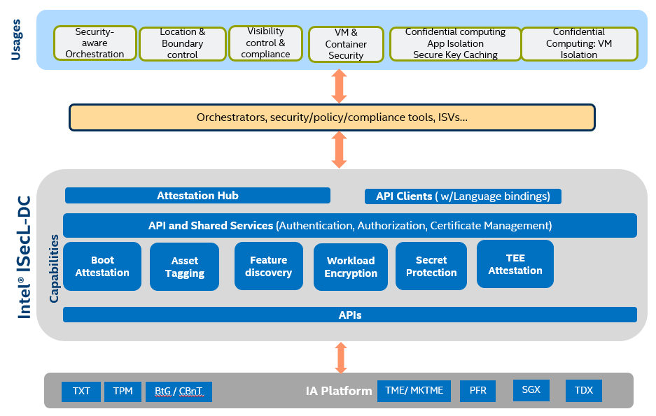

Intel® Security Libraries for Datacenter
=========================================

# Current Release
INTEL® SECL - DC 5.0.0 GA RELEASE (NEW!)
 
# WHAT IS INTEL® SECL - DC?
Hardware-based cloud security solutions provide a higher level of protection as compared to software-only security measures. There are many Intel platform security technologies, which can be used to secure customers' data. Customers have found adopting and deploying these technologies at a broad scale challenging, due to the lack of solution integration and deployment tools. Intel® Security Libraries for Data Centers (Intel® SecL - DC) was built to aid our customers in adopting and deploying Intel Security features, rooted in silicon, at scale.

Intel® SecL-DC is an open-source remote attestation implementation comprising of a set of building blocks that utilize Intel Security features to discover, attest, and enable critical foundation security and confidential computing use-cases. It applies the remote attestation fundamentals and standard specifications to maintain a platform data collection service and an efficient verification engine to perform comprehensive trust evaluations. These trust evaluations can be used to govern different trust and security policies applied to any given workload.

This Intel® SecL-DC middleware provides

- Building blocks (Libraries and components) that discover, attest, and utilize Intel security features to enable critical cloud security & confidential computing use-cases.

- Use different TEEs (TPM, Intel(R) Software Guard Extensions(SGX)) for Application Data Protection & Key Management.

- Consistent set of APIs for easy integration with cloud management software and security monitoring and enforcement tools for visibility and control.

- Micro services-based model to expose and use Intel security features.

- Built for cloud scale with the ability to deploy as containerized components.

- Extensible to include any future security use-cases and technologies.

- Supports RHEL*, Ubuntu*, and VMWare* ESXi

- Supports plugins for orchestrators including Kubernetes*

- Automation of deployment and provisioning

**Intel® SecL-DC is provided as reference code and is also extensible to include any future security use cases and technologies.**

The below diagram depicts the high level architecture of the Intel(R)SecL-DC middleware, enabling the use cases for:

Hardware and platform attestation
Discovery and attestation
Data sovereignty
Workload (container) Integrity & Confidentiality
Platform integrity assurance
Workload integrity and confidentiality assurance
Data Protection & Confidential Computing
Data confidentiality, workload cryptographic isolation
TEEs for Data Protection & Key Management (Intel(R) SGX)
The bottom part of the architecture diagram indicates the various technologies that would be used to support the different capabilities mentioned. The system supports REST interfaces for internal/external communication including integration with external orchestrators and compliance tools.  The topmost layer lists out the various use cases that could be implemented in a data center using the capabilities that the system supports.

The system provides integration plug-ins to cloud orchestrator solutions like K8S* supporting the CRIO runtime.
 

 
 
# INTEL®'S ROLE IN INTEL® SECL-DC
Intel is the leading contributor and maintainer of Intel® SecL-DC, which leverages Intel® processors with different security technologies including Intel® Trusted Execution Technology (Intel® TXT), Boot Guard (BtG), Intel® Software Guard Extensions (Intel® SGX) and other upcoming technologies in its platform to provide the next generation attestation solution that can be used in private and public clouds.
