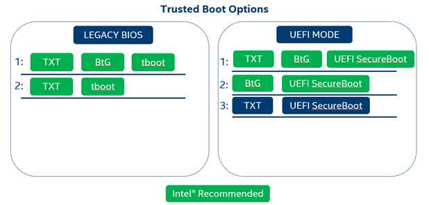

# Hardware Security Technology Considerations

Intel® SecL-DC supports and uses a variety of Intel security features, but there are some key requirements to consider before beginning an installation. Most important among these is the Root of Trust configuration. This involves deciding what combination of TXT, Boot Guard, tboot, and UEFI Secure Boot to enable on platforms that will be attested using Intel® SecL.

Key points:

\-   At least one "Static Root of Trust" mechanism must be used (TXT and/or BtG)

\-   For Legacy BIOS systems, tboot must be used (which requires TXT)

\-   For UEFI mode systems, UEFI SecureBoot must be used

\-   IMA(Integrity Measurement Architecture) needs to be provisioned in all platforms which needs to be attested before the deployment

---
**NOTE**
Currently tboot and Secure Boot are not compatible. For UEFI platforms, Intel reccomends enabling TXT and enabling Secure Boot.  If Secure Boot will not be used, then Intel recommends enabling TXT and installing tboot.

These hardware security technology requirements apply to all platforms to be attested.  In a Kubernetes environment, this would typically include all worker nodes.

---

Use the chart below for a guide to acceptable configuration options. .




# Tboot Installation

Tboot is required to build a complete Chain of Trust for Intel® TXT systems that are not using UEFI Secure Boot. Tboot acts to initiate the Intel® TXT SINIT ACM (Authenticated Code Module), which populates several TPM measurements including measurement of the kernel, grub command line, and initrd. Without either tboot or UEFI Secure Boot, the Chain of Trust will be broken because the OS-related components will be neither measured nor signature-verified prior to execution. Because tboot acts to initiate the Intel® TXT SINIT ACM, tboot is only required for platforms using Intel® TXT, and is not required for platforms using another hardware Root of Trust technology like Intel® Boot Guard.

Intel® SecL-DC requires tboot 1.10.1 or greater. This may be a later version of tboot than is available on public software repositories.

The most current version of tboot can be found here:

https://sourceforge.net/projects/tboot/files/tboot/

Tboot requires configuration of the grub boot loader after installation. To install and configure tboot:

## Install tboot

If the package manager does not support a late enough version of tboot, it will need to be compiled from source and installed manually. Instructions can be found here:

https://sourceforge.net/p/tboot/wiki/Home/

---
**NOTE**
Check if kernal packages are excluded in `/etc/yum.conf`,then comment (or remove the 'kernel*' part) : `#exclude=kernel*`

---
```
yum install -y mercurial zlib-devel openssl-devel gcc
wget https://sourceforge.net/projects/tboot/files/tboot/tboot-1.10.5.tar.gz
tar -zxf tboot-1.10.5.tar.gz
cd tboot-1.10.5/
make
make install
```

---
**NOTE**
The step "copy platform SINIT to /boot" should not be required, as datacenter platforms include the SINIT in the system BIOS package.

---

## Ensure that multiboot2.mod and relocator.mod are available for grub2

This step may not be necessary for all OS versions. For instance, this step is not applicable for tboot installation on Ubuntu 18.04. In order to utilize tboot, grub2 requires these two modules from the grub2-efi-x64-modules package to be located in the correct directory (if they're absent, the host will throw a grub error when it tries to boot using tboot).

These files must be present in this directory:

```
/boot/efi/EFI/redhat/x86_64-efi/multiboot2.mod
/boot/efi/EFI/redhat/x86_64-efi/relocator.mod
```

If the files are not present in this directory, they can be moved from their installation location:

```
mkdir -p /boot/efi/EFI/redhat/x86_64-efi/
cp /usr/lib/grub/x86_64-efi/multiboot2.mod /boot/efi/EFI/redhat/x86_64-efi/
cp /usr/lib/grub/x86_64-efi/relocator.mod /boot/efi/EFI/redhat/x86_64-efi/
```

If the files are not present in their installation location `/usr/lib/grub/x86_64-efi/`, then follow below steps:

```
yum install -y grub2-efi-x64-modules
```

Make a backup of your current grub.cfg file

The below examples assume a RedHat OS that has been installed on a platform using UEFI boot mode. The grub path will be slightly different for platforms using a non-RedHat OS.

```
cp /boot/efi/EFI/redhat/grub.cfg /boot/efi/EFI/redhat/grub.cfg.bak
```

Generate a new grub.cfg with the tboot boot option

For RHEL:

```
grub2-mkconfig -o /boot/efi/EFI/redhat/grub.cfg
```

For Ubuntu:

```
grub2-mkconfig -o /boot/grub/grub.cfg
```

## Ensure that the GRUB_DEFAULT value is set to the tboot option.

Update /etc/default/grub and set the GRUB_DEFAULT value to 'tboot-1.10.5'

```
GRUB_DEFAULT='tboot-1.10.5'
```

## Regenerate grub.cfg:

For RHEL:

```
grub2-mkconfig -o /boot/efi/EFI/redhat/grub.cfg
```

For Ubuntu:

```
grub2-mkconfig -o /boot/grub/grub.cfg
```

Reboot the system.  Because measurement happens at system boot, a reboot is needed to boot to the tboot boot option and populate measurements in the TPM.

## Verify a successful trusted boot with tboot

Tboot provides the txt-stat command to show the tboot log. The first part of the output of this command can be used to verify a successful trusted launch. In the output below, note the “TXT measured launch” and “secrets flag set” at the bottom. Both of these should show "TRUE" if the tboot measured launch was successful. If either of these show "FALSE" the measured launch has failed. This usually simply indicates that the tboot boot option was not selected during boot.

```
txt-stat
```

If the measured launch was successful, proceed to install the Trust Agent.

```
Intel(r) TXT Configuration Registers:
        STS: 0x0001c091
            senter_done: TRUE
            sexit_done: FALSE
            mem_config_lock: FALSE
            private_open: TRUE
            locality_1_open: TRUE
            locality_2_open: TRUE
        ESTS: 0x00
            txt_reset: FALSE
        E2STS: 0x0000000000000006
            secrets: TRUE
        ERRORCODE: 0x00000000
        DIDVID: 0x00000001b0078086
            vendor_id: 0x8086
            device_id: 0xb007
            revision_id: 0x1
        FSBIF: 0xffffffffffffffff
        QPIIF: 0x000000009d003000
        SINIT.BASE: 0x6fec0000
        SINIT.SIZE: 262144B (0x40000)
        HEAP.BASE: 0x6ff00000
        HEAP.SIZE: 1048576B (0x100000)
        DPR: 0x0000000070000051
            lock: TRUE
            top: 0x70000000
            size: 5MB (5242880B)
        PUBLIC.KEY:
            9c 78 f0 d8 53 de 85 4a 2f 47 76 1c 72 b8 6a 11
            16 4a 66 a9 84 c1 aa d7 92 e3 14 4f b7 1c 2d 11

***********************************************************
         **TXT measured launch: TRUE**
         **secrets flag set: TRUE**
***********************************************************
```

# Integrity Measurement Architecture (IMA) Agent

IMA is based on the Trusted Computing Group's open standards, including Trusted 
Platform Module (TPM), Trusted Boot, Trusted Software Stack (TSS), Trusted 
Network Connect (TNC), and Platform Trust Services (PTS).

**Goals of the kernel integrity subsystem:**
 \* Detect if files have been accidentally or maliciously altered, both remotely 
 and locally
 \* Appraise a file's measurement against a "good" value stored as an extended
 attribute
 \* Enforce local file integrity

This is complementary to Mandatory Access Control (MAC) protections provided by 
LSM modules. Depending on specified LSM policies, IMA can attempt to protect 
file integrity.

**IMA Components:**
 \* **IMA-measurement** – Measures files before being opened or executed and 
 extends to TPM PCR 10
 \* **IMA-appraisal** - Extends the "secure boot" concept of verifying a file's 
 integrity, before transferring control or allowing the file to be accessed by 
 the OS
 \* **IMA-audit** – Includes file hashes in the system audit logs, which can be 
 used to augment existing system security analytics/forensics

IMA maintains a runtime measurement list and if anchored in hardware 
(e.g. TPM), maintains an aggregate integrity value over this list. The 
measurement list cannot be compromised by any software attack, without being 
detectable. If a malicious file is accessed, its measurement is committed to 
the TPM before the file is accessed, and the malicious code cannot remove this 
measurement. If the malicious software compromises the attestation software, it 
cannot conceal its presence, because it cannot forge a signature on a fake 
measurement list. IMA measurement and attestation do not attempt to protect a 
system's integrity. The goal is to detect if such compromise has occurred, so 
that it can be repaired in a timely manner.

**IMA Measurement**

LSM - Linux Security Modules maintain file metadata, which can be leveraged to limit the number of files measured. IMA-measurement using Custom IMA policy maintains a runtime measurement list and anchored in a 
hardware Trusted Platform Module (TPM), an aggregate integrity value over this 
list. The benefit of anchoring the aggregate integrity value in the TPM is that 
the measurement list cannot be compromised by any software attack, without 
being detectable. Hence, on a trusted boot system, IMA-measurement can be used 
to attest to the system's runtime integrity.

All measurements are recorded in a runtime measurement list located in 
`securityfs`:

    /sys/kernel/security/ima/ascii_runtime_measurements

These measurements are also extended to the system TPM if present.

IMA is controlled with several kernel command line parameters:

    ima_policy = custom LSM(SELinux) object type
        
    ima_template = ima-ng
        ima-ng - latest template format for measurement log (default since Linux 3.13)

    ima_hash = sha256  
        ['sha256' default since Linux 3.13]

Custom IMA policy rules can be defined in /etc/ima/ima-policy. These custom 
rules can leverage LSM labels to measure or appraise specific file sets or 
categories. The custom policies can likewise be used to exclude these 
categories or types from IMA measurement or appraisal. If the IMA policy 
contains LSM labels, then the LSM policy must be loaded prior to the IMA 
policy.

#### ISecL IMA measurement components for the node are comprised of two stages:

1. Provision  
2. Collect and Report  

#### Steps for IMA Provision

1. Download IMA provision script from the below mention location.
    https://github.com/intel-secl/utils/tree/v5.1/develop/tools/ima-agent

2. Prerequisite before provision.
    \- SELinux needs to be in permissive mode
        
        Update `/etc/selinux/config` file with `SELINUX=permissive`and reboot the system.
        After reboot, verify using `sestatus` and check SELinux mode is `permissive`
    
    ???+ note 
            swap needs to be disabled if it was enabled `swapoff -a` and restart kubelet `systemctl restart kubelet`

    \* User needs to install `selinux-policy-devel` package before running the script to apply custom policy.
        ```
        dnf install selinux-policy-devel
        ```

3. Enabling Custom Policy  
    \- Change the provision script mode to execution.
        ```
        chmod -x ima-provision.sh
        ```

    \- ```sh ima-provision.sh set-custom-policy -i [File with list of one or more Directory or File path] --hash [sha256]  ```  

    ???+ note 
            set-custom-policy - This option will create the SElinux custom object type and assign to the specific directory  
            File or folder path mentioned inside input file-list should be present in the system, then only custom policy will be applied.
                e.g: `./ima-provision.sh set-custom-policy -i /tmp/ima.txt --hash sha256`
                ```
                cat /tmp/ima.txt
                /etc/crio/crio.conf
                ```

4. Reboot the host for the IMA provision changes to reflect.

5. Verify default measurements captured under `/sys/kernel/security/ima/ascii_runtime_measurements`

6. gen-measurements – This option will label the system and log measurements inside ascii_runtime_measurements

???+ note 
  \- If a folder path is mentioned inside the file list, then it will apply custom policy for all the files inside that folder.
  \- To add new file or folder for generating measurement without reboot, run below command and execute `step 6`.
    `chcon -R -t isecl_t < folder or file details >`

### Important Notes

  * Only Custom IMA policy shall be supported.   
  * To completely remove `isecl` selinux custom policy from the host:    
	- Delete ima custom policy file:   `rm -rf /etc/ima/`  
	- Remove isecl selinux policy:     `semodule -r isecl`(this will automatically remove and reboot the system)  
  * Command to verify `isecl` selinux custom policy was removed:  `semodule -l | grep isecl`
  * Command to update the kernel to remove ima arguments.
    `grubby --update-kernel=/boot/vmlinuz-$(uname -r) --remove-args="ima_template=ima-ng ima_hash=sha256"`
  * Reboot the system to update the kernel.
