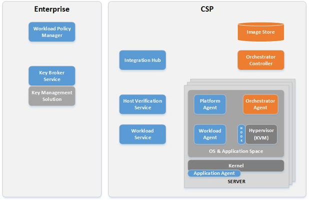
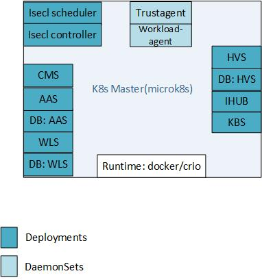
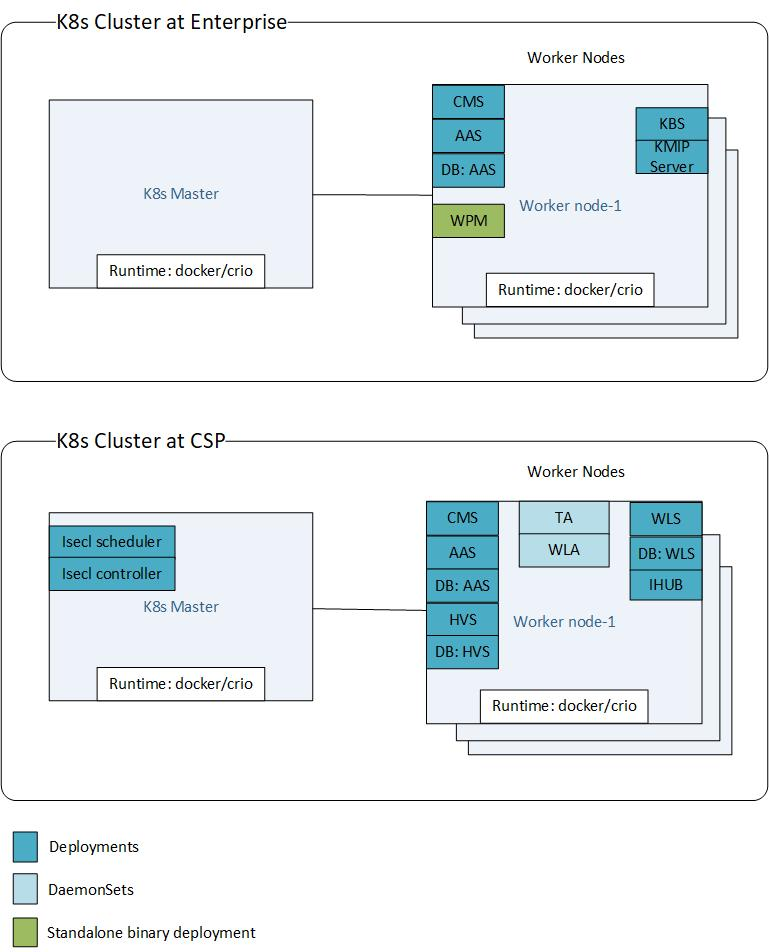
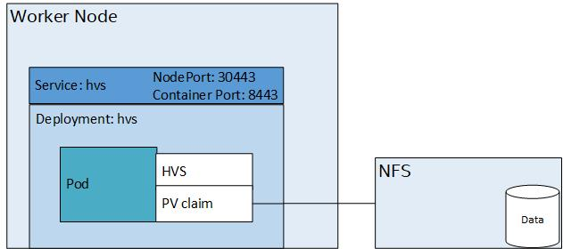
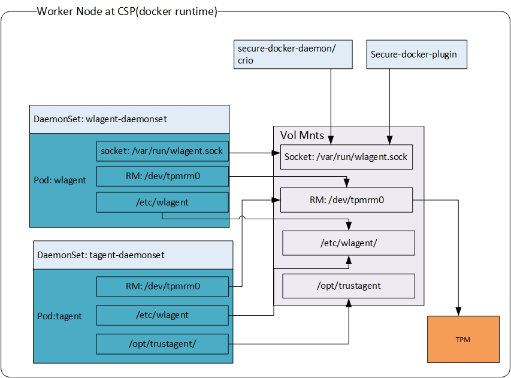
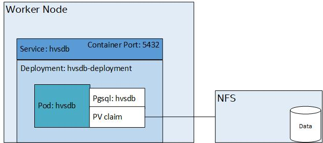
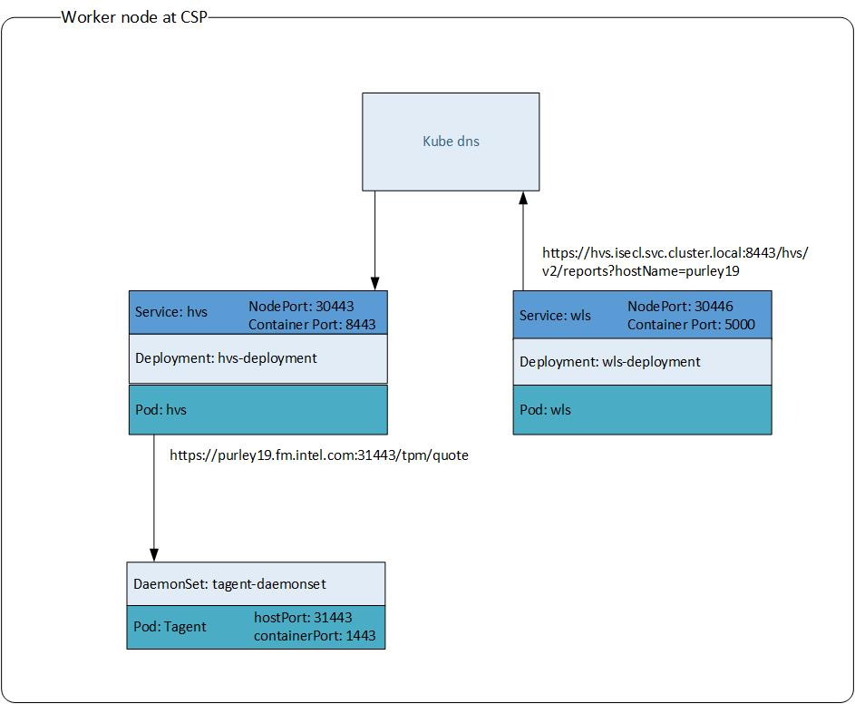

## Recommended Service Layout

The Intel® SecL-DC services can be installed in a variety of layouts, partially depending on the use cases desired and the OS of the server(s) to be protected. In general, the Intel® SecL-DC applications can be divided into management services that are deployed on the network on the management plane, and host or node components that must be installed on each protected server.

Management services can typically be deployed anywhere with network access to all of the protected servers. This could be a set of individual VMs per service; containers; or all installed on a single physical or virtual machine.

Node components must be installed on each protected physical server. Typically this is needed for Windows and Linux deployments.

### Platform Integrity

The most basic use case enabled by Intel® SecL-DC, Platform Integrity requires only the Verification Service and, to protect Windows or Linux hosts, the Trust Agent. This also enables the Application Integrity use case by default for Linux systems.

The Integration Hub may be added to provide integration support for OpenStack or Kubernetes. The Hub is often installed on the same machine as the Verification Service, but optionally can be installed separately.

### Workload Confidentiality

Workload Confidentiality introduces a number of additional services and agents. For a POC environment, all of the management services can be installed on a single machine or VM. This includes:

* Certificate Management Service (CMS)

* Authorization and Authentication Service (AAS)

* Host Verification Service (HVS)

* Workload Service (WLS)

* Integration Hub (HUB)

* Key Broker Service (KBS) with backend key management

* Workload Policy Manager (WPM)

In a production environment, it is strongly suggested that the WPM and KBS be deployed (with their own CMS and AAS) separately for each image owner. For a Cloud Service Provider, this would mean that each customer/tenant who will use the Workload Confidentiality feature would have their own dedicated AAS/CMS/KBS/WPM operated on their own networks, not controlled by the CSP. This is because the Key Broker and WPM are the tools used to define the policies that will allow images to launch, and these policies and their enforcement should remain entirely under the control of the image owner.

The node components must be installed on each protected physical server:

* Trust Agent (TA)

* Workload Agent (WLA)

## Recommended Service Layout & Architecture - Containerized Deployment with K8s

The containerized deployment makes use of Kubernetes orchestrator for single node and multi node deployments.

A single-node deployment uses Microk8s to deploy the entire control plane in a pod on a single device.  This is best for POC or demo environments, but can also be used when integrating Intel SecL with another application that runs on a virtual machine - the single node deployment can run in the same VM as the integrated application to keep all functions local.

**Single Node:**

A multi-node deployment is a more typical Kubernetes architecture, where the Intel SecL management plane is simply deployed as a Pod, with the Intel SecL agents (the WLA and the TA, depending on use case) deployed as a DaemonSet.

**Multi Node:**

**Services Deployments & Agent DaemonSets:**

Every service including databases will be deployed as separate K8s deployment with 1 replica, i.e(1 pod per deployment). Each deployment will be further exposed through k8s service and also will be having corresponding Persistent Volume Claims(PV) for configuration and log directories and mounted on persistent storage. In case of daemonsets/agents, the configuration and log directories will be mounted on respective Baremetal worker nodes.

For stateful services which requires database like shvs, aas, scs, A separate database deployment will be created for each of such services. The data present on the database deployment will also made to persist on a NFS, through K8s persistent storage mechanism

**Networking within the Cluster:**

**Networking Outside the Cluster:**

