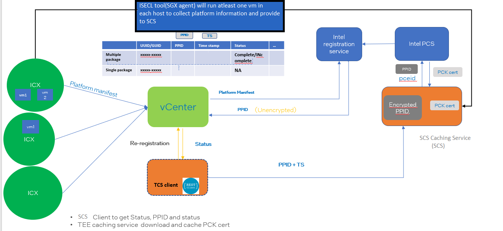
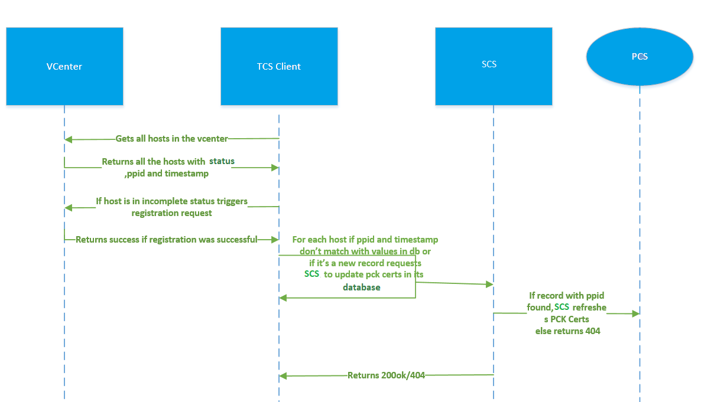
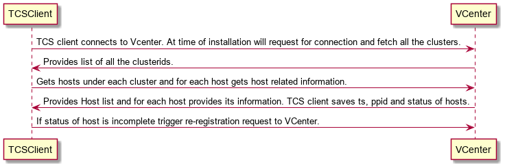
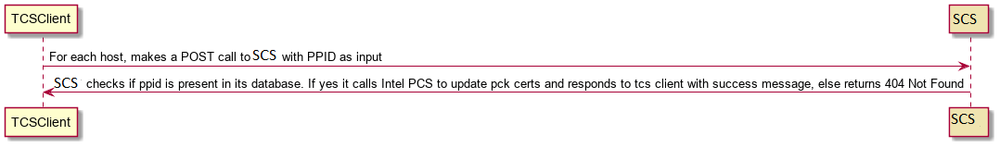

# VMware Caching Service

>**NOTE**
Before installing TCS client,ISECL service cms, aas and scs services needs to be installed as part of SGX-VMWare helm deployment mentioned in `Deploying SGX Use Cases Using Helm` section.

#### Architecture
This document defines design specifications for TCS Client and SCS, a component of ISECL.


##### Introduction
When a security vulnerability is found and it affects one of the components in the Intel® SGX TCB, an Intel® SGX TCB Recovery Event process is initiated. This could result in microcode or bios to be updated. Once tcb recovery is done the platform needs to be registered again with Intel PCS.
In case of tcb recovery VCenter applies BIOS update or SGX factory reset. It then changes hosts status to INCOMPLETE(same case holds if a new host is added to VCenter). TCS Client will identify SGX Hosts marked as INCOMPLETE and request VCENTER to perform re-registration of such hosts. Elaborate explanation is provided below:

When a host comes up in a VCenter cluster, it needs to be registered to Intel PCS. Following flow is implemented by **VMWare** for same:
* Place ESX host in maintenance mode
* Register host with Intel registration service
* Get platform PPID and Timestamp
* Remove host from maintenance mode

However in case of TCB Recovery a request needs to be sent to VCenter to do following work:
* Place ESX host in maintenance mode
* Reboot host
* Apply BIOS update or SGX factory reset
* Reboot host
* Register host with Intel registration service
* Get platform PPID and Timestamp
* Remove host from maintenance mode

In order to facilitate above mentioned steps Intel will provide:
* SGX Agent(ISECL tool) to push platform data to SCS
* A TCS Client which will request VCenter to register its host in case of TCB recovery or if the host is not yet registered.It will also contact SCS to download/update pck certs

>**NOTE**
Details on Intel provided services like cms, aas and scs are placed under `SGX Attestation Infrastructure` section.

##### Design flow:

##### End To End Flow Diagram



1. TCS client runs as a daemon and gets all hosts(irrespective of their status).
2. For each unregistered host triggers registration.
3. For each host if its ppid/timestamp is changed, TCS client makes a REST Call to SCS to update PCK Certs. Since initially, there is no platform data in SCS 404 is returned.
4. If return code is 404, TCS Client  don't insert corresponding record into its database
5. Once registration is successful then only a vm can be spawned on any host. On the spawned vm(at least one) SGX Agent is installed and executed.
6. Upon execution, SGX Agent gathers platform collateral and push them to SCS. Please note that since registration of platform has already been taken place hence when SGX Agent pushes data no registration takes place.
7. Upon second iteration when TCS Client runs, for hosts(irrespective of status) not present in its database/newly registered it makes a REST Call to SCS and download/update PCK Certs. Since platform data is pushed by SGX Agent as mentioned in step 6 pck certs are refreshed.

##### Detailed Design

TCS Client:
TCS Client will run as a daemon. At the time of installation it will connect to VCenter and gets all the host related information. It also runs every t th hour(configurable).
###### TCS Client-VCenter detailed flow:


For each registered host in a cluster, VCenter stores its information(PPID,timestamp, status) in its database.


##### TCS Client Installation

##### Cloning repo:

- git clone https://github.com/intel-secl/isecl-vmw.git 

##### Pre-Reqs:

- OS: RHEL 8.4, Ubuntu 20.04
- python version-3.8.10
- python3.8 virtual environment and pip
- create soft link between python3 and python 
    ```
    ln -s /usr/bin/python3 /usr/bin/python
    ```
- user requires `sudo` access to run below mentioned scripts.

1) DB Setup:
    run postgres script `./install_pgdb.sh` under scripts folder
2) Create DB: 
    `./create_db.sh <db name> <db user> <db password>` in scripts folder

>**NOTE**
DB Setup and Create DB steps needs to be executed only once.
Use `db name`,`db user` and `db password` same as mentioned in `tcs-client.env` file.

To install TCS-Client run the following command
1) populate tcs_client.env and place in home directory. Refer Setup section below.
2) run `./scripts/install.sh`

###### To Check status:
> tcs-client status

##### Setup
Name:tcs-client.env:
```go
TC_DB_HOST=<db host name>
TC_DB_NAME=<db name>
TC_DB_USER=<db user name>
TC_DB_PASSWD=<db user password>
VCENTER_IP=<VCenter IP/Hostname>
VCENTER_PORT=<VCenter port>
VCENTER_ADMIN_NAME=<VCenter admin username>
VCENTER_ADMIN_PASSWORD=<VCenter admin password>
REGISTRATION_URL='https://<vcenter_ip:port>/api/vcenter/confidential-computing/sgx/hosts?action=register&vmw-task=true'
TCS_URL=https://<scs ip:port>/scs/sgx/certification/v1/pckcert
SESSION_URL=https://<vcenter ip:port>/api/session
TASK_URL=https://<vcenter ip:port>/api/cis/tasks/
TIMER_MINS=<time to restart timer in minutes>
LOG_LEVEL=debug #TCS Client Log Level
```

>**NOTE**
For `TCS_URL`, ip address and port needs to point to the scs service running as part of SGX-VMWare deployment mentioned in `Deploying SGX Use Cases Using Helm` section
    Eg: `https://<cluster_master_ip>:30502/scs/sgx/certification/v1/pckcert`


On installation TCS Client will do following:
1. Gets clusters in a VCenter.
2.  For each cluster get it's hosts.
3.  For each host get its HostSgxRegistrationInfo(includes ppid, status and timestamp).
    * If the status of host is incomplete TCS Client requests VCenter to register it
    * TCS Client sends the ppid to SCS(this is for all hosts irrespective of the status).
    * SCS checks in its database for the host. If host exists then it uses host's collateral to fetch updated PCK Certs and stores them. This flow facilitates sgx-attestaion.

After t th hour TCS Client will repeat the process mentioned above (the case holds same in case of restarting the client). It will get all the hosts from vcenter. Host related information is sent to SCS. For incomplete status hosts above mentioned flow is triggered.

##### TCS Client to SCS flow:

Once host is registered successfully or a new host with status=complete and no record in db is found, TCS Client will provide PPID to SCS so that it can get updated PCK Certs.

##### REST API Calls

TCS Client -> SCS



 ````markdown
 URL: /scs/sgx/certification/v1/pckcert
 Method: PUT
 Headers: "Accept" : "application/json"
 URL Params: N/A
 Data Params: {ppid: <>}
 Code: 200 OK/ 404 NotFound
Content:
{
  Status: "Successful"
}
````

##### SCS Design
A new PUT API in SCS to check if the host's PPID is present in its database. If yes then SCS will fetch the corresponding updated PCK Certificate from PCS and update in its database. If not it will return "Not Found"

##### Command Line Interface
The compiled TCS Client binary shall be labeled "TCSClient". Here is a full list of TCSClient CLI commands:
start
stop
status
version
help
uninstall [--purge]

The CLI will support the following systemd daemon functionality:

> start
> stop
> status

Example:
> tcs-client start

The CLI will support a command to get the Version of TCS Client service. This command will print version details on console.

> tcs-client version

##### Logging
Logs pertaining to the TCS Client daemon shall be logged in journalctl. Logs should be able to be viewed by running the command:
> journalctl -u tcsclient

>**NOTE**
tcs-client logs are placed under `/var/log/tcs-client/`
scs logs are placed under NFS path - `/mnt/nfs_share/isecl/scs/logs`
sgx-agent logs are placed under `/var/log/sgx_agent/` in the SGX host


#### DataBase Design

The client's database consists of a single table:

| Status | ppid | created_on | updated_on | registered_time |

> Primary Key: PPID
