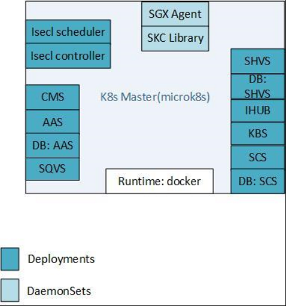
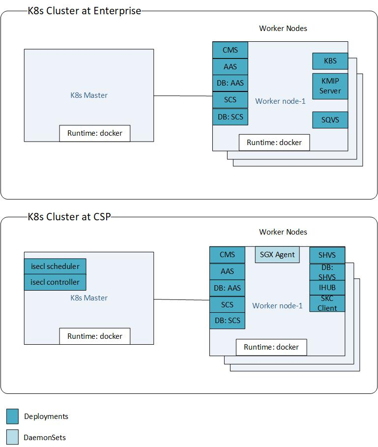
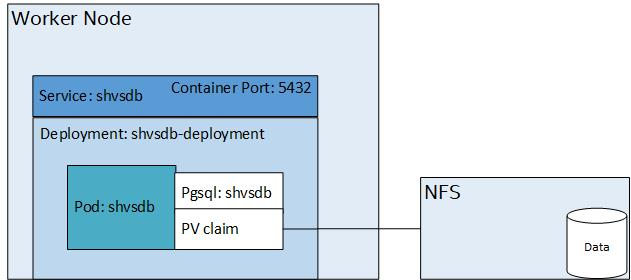
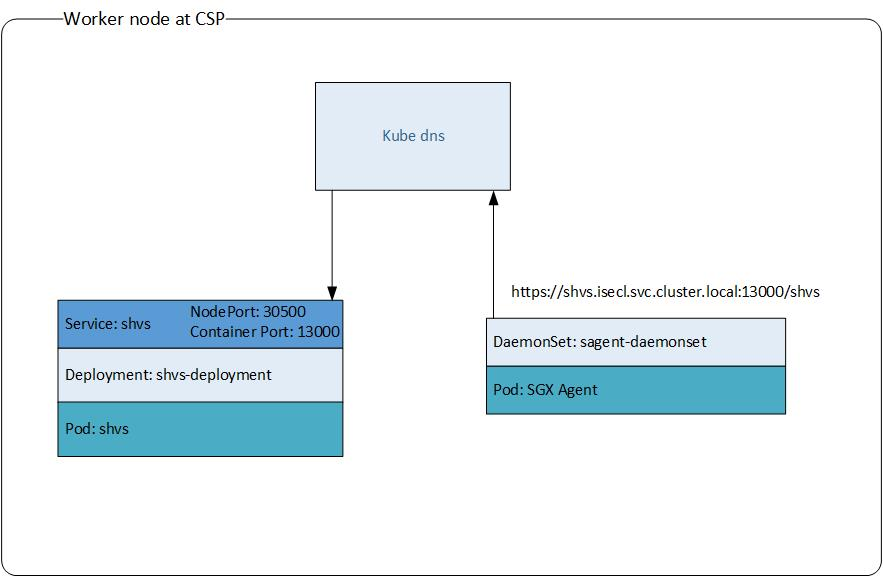
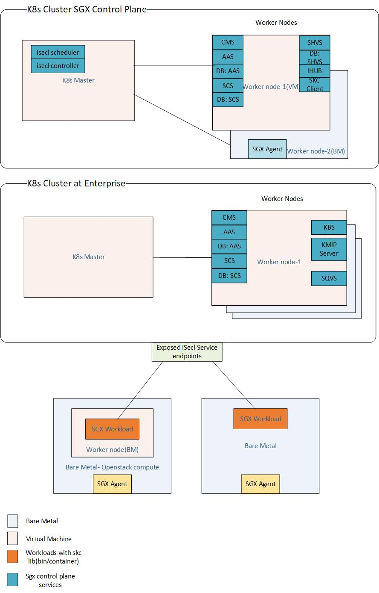

# Intel® Security Libraries Installation

## Building from Source - OCI images & K8s Manifests

Intel® Security Libraries is distributed as open source code and must be compiled into OCI images before installation.

Instructions and sample scripts for building the Intel® SecL-DC components  as containerized images for Kubernetes deployments can be found in [Quick Start guide](https://github.com/intel-secl/docs/blob/v5.0/develop/quick-start-guides/SGX%20Infrastructure%20-%20Containerization.md#build)

After the components have been built, the OCI images and pre-req scripts can be found in the `K8s` directory created by the build scripts.

Generated components `OCI images`  under `<working directory>/k8s/container-images`:

* Authentication Authorization Service: `aas-v4.1.0.tar`
* Certificate Management Service: `cms-v4.1.0.tar`
* Integration Hub: `ihub-v4.1.0.tar`
* Key Broker Service: `kbs-v4.1.0.tar`
* K8s Extensions Custom Controller: `isecl-k8s-controller-v4.1.0.tar`
* K8s Extensions Extended Scheduler: `isecl-k8s-scheduler-v4.1.0.tar`
* SGX Caching Service: `scs-v4.1.0.tar`
* SGX Quote Verification Service: `sqvs-v4.1.0.tar`
* SGX Host Verification Service: `shvs-v4.1.0.tar`
* SGX Agent: `sgx-agent-v4.1.0.tar`
* SKC Library: `skc-lib-4.1.0.tar`

Generated Components `K8s Manifests` directories under `<working directory>/k8s/manifests`:

* Authentication Authorization Service Database: `aas-db`
* SGX Caching Service Database: `scs-db`
* SGX Host Verification Service Database: `shvs-db`
* Certificate Management Service: `cms`
* Authentication Authorization Service: `aas`
* Integration Hub: `ihub`
* Key Broker Service: `kbs`
* SGX Caching Service: `scs`
* SGX Host Verification Service: `shvs`
* SGX Quote Verification Service: `sqvs`
* K8s Extensions Custom Controller: `k8s-extensions-controller`
* K8s Extensions Extended Scheduler: `k8s-extensions-scheduler`
* SGX Agent: `sgx_agent`
* SKC Library: `skc_library`

Bootstrap scripts and answer file under `<working directory>/k8s/manifests`:

* Pre-req: `pre-requisites.sh`
* Bootstrap DB: `skc-bootstrap-db-services.sh`
* Answer file: `isecl-skc-k8s.env`
* Bootstrap: `skc-bootstrap.sh`

## Hardware Considerations

### Supported **Hardware**

-   Intel® Xeon® SP products those support SGX

### BIOS Requirements

-   Intel® SGX-TEM BIOS requirements are outlined in the latest Intel® SGX Platforms BIOS Writer's Guide

-   Intel® SGX should be enabled in BIOS menu (Intel® SGX is Disabled by default on Ice Lake).

-   Intel® SGX BIOS requirements include exposing Flexible Launch Control menu.


### OS Requirements (Intel® SGX is not supported on 32-bit OS):

-   Linux: RHEL 8.2

-   Linus: RHEL 8.4 for Stock based deployment

-   Linux: Ubuntu 18.04/20.04

### Requirements for Containerized Deployment with K8s

#### Operating System:

* RHEL 8.2
* RHEL 8.4 for Stack based deployment
* Ubuntu 18.04/20.04

#### Kubernetes

* Single-node: `microk8s` (1.21.3)
* Multi-node: `kubeadm` (1.21.3)

#### Container Runtime

* Docker 20.10.8 on RHEL 8.2
* Docker 20.10.8 on Ubuntu 18.04/20.04

#### Storage:

* `hostPath` for Single Node `microk8s` for all services and agents
* `NFS` for Multi Node `kubeadm` for all services, `hostPath ` for sgx_agent and skc_library

##  Recommended Service Layout

The Intel® SecL-DC services can be installed in a variety of layouts, partially depending on the use cases desired and the OS of the server(s) to be protected. In general, the Intel® SecL-DC applications can be divided into management services that are deployed on the network on the management plane, and host or node components that must be installed on each protected server.

Management services can typically be deployed anywhere with network access to all the protected servers. This could be a set of individual VMs per service; containers; or all installed on a single physical or virtual machine.

Node components must be installed on each protected physical server.

Typically, this is needed for Linux deployments.

For a POC environment, all the management services can be installed on a single machine or VM.

This Includes:

-   Certificate Management Service (CMS)

-   Authentication and Authorization Service (AAS)

-   TEE Caching Service (TCS)

-   Feature Discovery Service (FDS)

-   Integration HUB (IHUB)

-   Key Broker Service (KBS) with backend key management

-   Quote Verification Service (QVS)

Feature Discovery Agent & SKC Library needs to be installed on SGX Enabled Machine.

Isecl-K8s-extensions must be installed on separate VM.

## Recommended Service Layout & Architecture - Containerized Deployment with K8s

The containerized deployment makes use of Kubernetes orchestrator for single node and multi node deployments. The supported deployment models are as below:

**Single Node:**




**Multi Node:**




**Services Deployments & Agent DaemonSets:**

Every service including databases will be deployed as separate K8s deployment with 1 replica, i.e(1 pod per deployment). Each deployment will be further exposed through k8s service and also will be having corresponding Persistent Volume Claims(PV) for configuration and log directories and mounted on persistent storage. In case of daemonsets/agents, the configuration and log directories will be mounted on respective Baremetal worker nodes.


For stateful services which requires database like shvs, aas, scs, A separate database deployment will be created for each of such services. The data present on the database deployment will also made to persist on a NFS, through K8s persistent storage mechanism




**Networking within the Cluster:**



**Networking Outside the Cluster:**


**SKC Virtualization:**



Follow the [Installation of Containerized Services and Agent in K8s Cluster](#Installation of Containerized Services and Agent in K8s Cluster) for installation instructions once deployment model is chosen


## Installation of Linux Stacks for Intel SGX

To setup and deployment of the Linux* Stacks for Intel® SGX, follow https://download.01.org/intelsgxstack/2021-07-28/Getting_Started.pdf

## Installation of Containerized Services and Agent in K8s Cluster

The containerized deployment utilizes K8s orchestrator to deploy SGX components. The deployments are fairly automated once the pre-reqs are in place for K8s cluster deployments.

???+ note 
    The K8s manifests are declarative in nature and the same can be modified as required for SGX services deployments for single node and multi node deployments. Modifications would require specific steps to ensure services and agents get updated as per the required configuration. More details for the same present in Setup Task Flows for K8s Deployments, Configuration Update Flows for K8s Deployments and [Intel Security Libraries Configuration Settings ](#intel-security-libraries-configuration-settings)

### Pre-requisites

* Ensure based on the deployment model , `microk8s` or `kubeadm` in installed. Supported versions in [Requirements for Containerized Deployment with K8s](#requirements-for-containerized-deployment-with-k8s)
* Docker runtime is configured for each of these deployments. Supported versions in [Requirements for Containerized Deployment with K8s](#requirements-for-containerized-deployment-with-k8s)
* The build would generate a script for platform dependencies under `<working directory>/k8s/platform dependencies`
* Follow the deployment pre-reqs as given in the [Quick Start guide](https://github.com/intel-secl/docs/blob/v4.1/develop/quick-start-guides/SGX%20Infrastructure%20-%20Containerization.md#deployment) based on the chosen deployment model

### Deploy Steps

* The deploy steps are detailed in the [Quick Start guide](https://github.com/intel-secl/docs/blob/v4.1/develop/quick-start-guides/SGX%20Infrastructure%20-%20Containerization.md#deploy-steps) based on the deployment model. Follow the instructions for the deployment using the scripts

### Additional Details

* [Default Service and Agent Mount Paths - Single Node](https://github.com/intel-secl/docs/blob/v4.1/develop/quick-start-guides/SGX%20Infrastructure%20-%20Containerization.md#default-service-and-agent-mount-paths)
* [Default Service and Agent Mount Paths - Multi Node](https://github.com/intel-secl/docs/blob/v4.1/develop/quick-start-guides/SGX%20Infrastructure%20-%20Containerization.md#multi-node-deployments)
* [Default Service Ports](https://github.com/intel-secl/docs/blob/v4.1/develop/quick-start-guides/SGX%20Infrastructure%20-%20Containerization.md#default-service-ports)
* [NFS Setup Pre-reqs - Multi Node](https://github.com/intel-secl/docs/blob/v4.1/develop/quick-start-guides/SGX%20Infrastructure%20-%20Containerization.md#setup-1)

## Installing the Certificate Management Service

### Required For

The CMS is REQUIRED for all use cases.

### Supported Operating System

The Intel® Security Libraries Certificate Management Service supports Red Hat Enterprise Linux 8.2 and Ubuntu 18.04.5/20.04.2 LTS(Bionic Beaver).

### Recommended Hardware

-   1 vCPUs

-   RAM: 2 GB

-   10 GB

-   One network interface with network access to all Intel® SecL-DC services

### Installation


## Setup K8S Cluster and Deploy Isecl-k8s-extensions

* Setup master and worker node for k8s. Worker node should be setup on SGX enabled host machine. Master node can be any system.

* To setup k8 cluster on RHEL 8.2, follow https://phoenixnap.com/kb/how-to-install-kubernetes-on-centos

* To setup k8s cluster on Ubuntu 18.04/20.04, follow the "Install, Enable and start the Docker daemon" section in Ubuntu Quick Start Guide - https://github.com/intel-secl/docs/blob/v4.1/develop/quick-start-guides/SGX%20Infrastructure.md
Once done, go to https://vitux.com/install-and-deploy-kubernetes-on-ubuntu/ and follow from step 3 onwards.

* Once the master/worker setup is done, follow below steps on Master Node:

### Untar packages and push OCI images to registry

* Copy tar output isecl-k8s-extensions-*.tar.gz from build system's binaries folder to /opt/ directory on the Master Node and extract the contents.

  ```shell
    cd /opt/
    tar -xvzf isecl-k8s-extensions-*.tar.gz
    cd isecl-k8s-extensions/
  ```

* Configure private registry

* Push images to private registry using skopeo command, (this can be done from build vm also)

  ```shell
     skopeo copy oci-archive:isecl-k8s-controller-v4.1.0-<commitid>.tar docker://<registryIP>:<registryPort>/isecl-k8s-controller:v4.0.1
     skopeo copy oci-archive:isecl-k8s-scheduler-v4.1.0-<commitid>.tar docker://<registryIP>:<registryPort>/isecl-k8s-scheduler:v4.0.1
  ```

* Add the image names in isecl-controller.yml and isecl-scheduler.yml in /opt/isecl-k8s-extensions/yamls with full image name including registry IP/hostname (e.g <registryIP>:<registryPort>/isecl-k8s-scheduler:v4.1.0). It will automatically pull the images from registry.


##### Deploy isecl-controller

* Create hostattributes.crd.isecl.intel.com crd

```
    kubectl apply -f yamls/crd-1.17.yaml
```

* Check whether the crd is created

```
    kubectl get crds
```

* Deploy isecl-controller

```
    kubectl apply -f yamls/isecl-controller.yaml
```

* Check whether the isecl-controller is up and running

```
    kubectl get deploy -n isecl
```

* Create clusterrolebinding for ihub to get access to cluster nodes

```
    kubectl create clusterrolebinding isecl-clusterrole --clusterrole=system:node --user=system:serviceaccount:isecl:isecl
```

* Fetch token required for ihub installation and follow below steps to update ihub.env,

```
    kubectl get secrets -n isecl
    kubectl describe secret default-token-<name> -n isecl
```

For IHUB installation, make sure to update below configuration in /root/binaries/env/ihub.env before installing ihub on CSP VM:

* Copy /etc/kubernetes/pki/apiserver.crt from master node to /root on CSP VM. Update KUBERNETES_CERT_FILE.
* Get k8s token in master, using above commands and update KUBERNETES_TOKEN
* Update the value of CRD name

```
	KUBERNETES_CRD=custom-isecl-sgx
```

##### Deploy isecl-scheduler

The isecl-scheduler default configuration is provided for common cluster support in /opt/isecl-k8s-extensions/yamls/isecl-scheduler.yaml.

Variables HVS_IHUB_PUBLIC_KEY_PATH and SGX_IHUB_PUBLIC_KEY_PATH are by default set to default paths.

Please use and set only required variables based on the use case.

For example, if only sgx based attestation is required then remove/comment HVS_IHUB_PUBLIC_KEY_PATH variables.

* Install cfssl and cfssljson on Kubernetes Control Plane
```
    #Download cfssl to /usr/local/bin/
    wget -O /usr/local/bin/cfssl http://pkg.cfssl.org/R1.2/cfssl_linux-amd64
    chmod +x /usr/local/bin/cfssl

    #Download cfssljson to /usr/local/bin
    wget -O /usr/local/bin/cfssljson http://pkg.cfssl.org/R1.2/cfssljson_linux-amd64
    chmod +x /usr/local/bin/cfssljson

```

* Create tls key pair for isecl-scheduler service, which is signed by k8s apiserver.crt

```
    cd /opt/isecl-k8s-extensions/
    chmod +x create_k8s_extsched_cert.sh
    ./create_k8s_extsched_cert.sh -n "K8S Extended Scheduler" -s "<K8_MASTER_IP>","<K8_MASTER_HOST>" -c /etc/kubernetes/pki/ca.crt -k /etc/kubernetes/pki/ca.key
```

* After iHub deployment, copy /etc/ihub/ihub_public_key.pem from ihub to /opt/isecl-k8s-extensions/ directory on k8 master vm. Also, copy tls key pair generated in previous step to secrets directory.

```
    mkdir secrets
    cp /opt/isecl-k8s-extensions/server.key secrets/
    cp /opt/isecl-k8s-extensions/server.crt secrets/
	mv /opt/isecl-k8s-extensions/ihub_public_key.pem /opt/isecl-k8s-extensions/sgx_ihub_public_key.pem
    cp /opt/isecl-k8s-extensions/sgx_ihub_public_key.pem secrets/
```

???+ note 
    Prefix the attestation type for ihub_public_key.pem before copying to secrets folder.

* Create kubernetes secrets scheduler-secret for isecl-scheduler

```
    kubectl create secret generic scheduler-certs --namespace isecl --from-file=secrets
```

* Deploy isecl-scheduler

```
    kubectl apply -f yamls/isecl-scheduler.yaml
```

* Check whether the isecl-scheduler is up and running

```
    kubectl get deploy -n isecl
```

##### Configure kube-scheduler to establish communication with isecl-scheduler

* Add scheduler-policy.json under kube-scheduler section, mountPath under container section and hostPath under volumes section in /etc/kubernetes/manifests/kube-scheduler.yaml as mentioned below

```
spec:
  containers:
  - command:
    - kube-scheduler
    - --policy-config-file=/opt/isecl-k8s-extensions/scheduler-policy.json
```

```
  containers:
    volumeMounts:
    - mountPath: /opt/isecl-k8s-extensions/
      name: extendedsched
      readOnly: true
```

```
  volumes:
  - hostPath:
      path: /opt/isecl-k8s-extensions/
      type:
    name: extendedsched
```

???+ note 
    Make sure to use proper indentation and don't delete existing mountPath and hostPath sections in kube-scheduler.yaml.

* Restart Kubelet which restart all the k8s services including kube base schedular

```
	systemctl restart kubelet
```

* Check if CRD Data is populated

```
	kubectl get -o json hostattributes.crd.isecl.intel.com
```


Run this command to validate if the data has been pushed to CRD:

```
    kubectl get -o json hostattributes.crd.isecl.intel.com
```

Run this command to validate that the labels have been populated:

```
    kubectl get nodes --show-labels.
```

Sample labels:

```
    EPC-Memory=2.0GB,FLC-Enabled=true,SGX-Enabled=true,SGX-Supported=true,SgxTrustExpiry=2020-11-09T08.07.43Z,TCBUpToDate=true
```

Create sample yml file for nginx workload and add SGX labels to it such as:

```
apiVersion: v1
kind: Pod
metadata:
  name: nginx
  labels:
    name: nginx
spec:
  affinity:
    nodeAffinity:
     requiredDuringSchedulingIgnoredDuringExecution:
       nodeSelectorTerms:
       - matchExpressions:
         - key: SGX-Enabled
           operator: In
           values:
           - "true"
         - key: EPC-Memory
           operator: In
           values:
           - "2.0GB"
  containers:
  - name: nginx
    image: nginx
    ports:
    - containerPort: 80
```

Validate if pod can be launched on the node. Run following commands:

```
    kubectl apply -f pod.yml
    kubectl get pods
    kubectl describe pods nginx
```

Pod should be in running state and launched on the host as per values in pod.yml. Validate running below commands on sgx host:

```
	docker ps
```


???+ note 
    When a 3rd-party Key Management Server is used, KBS supports only association of RSA key. User needs to create RSA key in backend kmip server and note the Private key Id. User also needs to create the tls certificate for the private key (it will be used during key transfer). rsa-create.py available in kbs_scripts can be used to create the private key and generate the certificate by providing the kmip server ip and certificates path in the script.

12. Restore index.html for the transferred key inside the container
    Get the container id using "docker ps" command
    docker exec -it <container_id> /bin/sh

    Download index.html
    wget https://localhost:2443 --no-check-certificate
```
