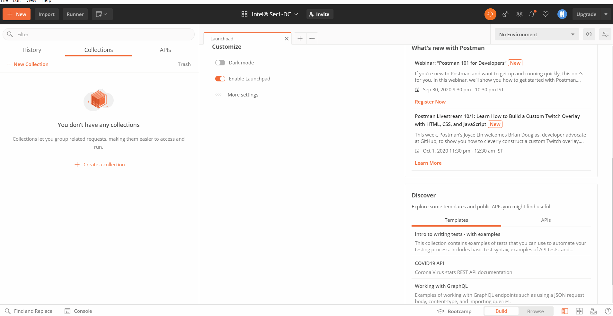
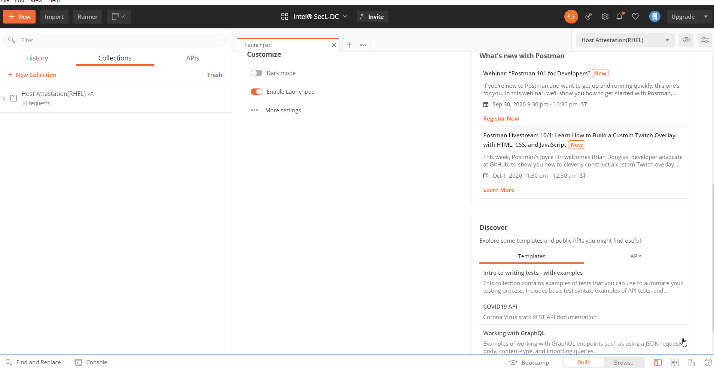
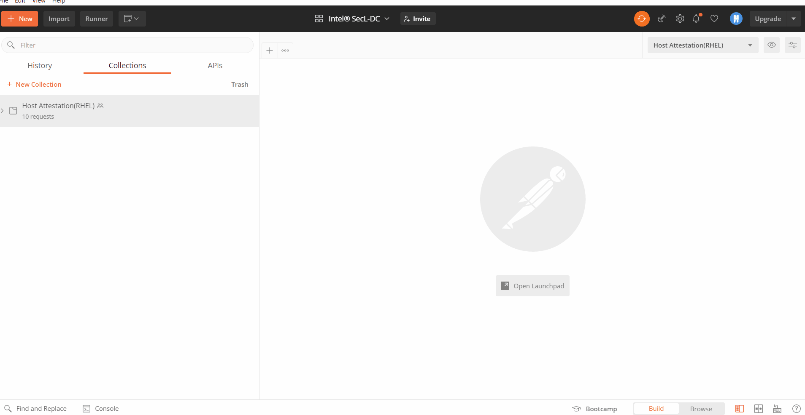

# Usecase Workflows API Collections

The below allow to get started with workflows within Intel® SecL-DC for Foundational and Workload Security Usecases. More details available in [API Collections](https://github.com/intel-secl/utils/tree/v5.0/develop/tools/api-collections) repository

## Pre-requisites

* Postman client should be [downloaded](https://www.postman.com/downloads/) on supported platforms or on the web to get started with the usecase collections.

???+ note  
    The Postman API Network will always have the latest released version of the API Collections. For all releases, refer the github repository for [API Collections](https://github.com/intel-secl/utils/tree/v5.0/develop/tools/api-collections)

## Use Case Collections

| Use case               | Sub-Usecase                                   | API Collection     |
| ---------------------- | --------------------------------------------- | ------------------ |
| Foundational Security  | Host Attestation(RHEL & VMWARE)                              | ✔️                  |
|                        | Data Fencing  with Asset Tags(RHEL & VMWARE)                 | ✔️                  |
|                        | Trusted Workload Placement (VM & Containers)  | ✔️ |
|                        | Application Integrity                         | ✔️                  |
| Launch Time Protection | VM Confidentiality                            | ✔️                  |
|                        | Container Confidentiality with CRIO Runtime   | ✔️                  |

???+ note  
    `Foundational Security - Host Attestation` is a pre-requisite for all usecases beyond Host Attestation. E.g: For working with `Launch Time Protection - VM Confidentiality` , Host Attestation flow must be run as a pre-req before trying VM Confidentiality

## Downloading API Collections

* Postman API Network for latest released: https://explore.postman.com/intelsecldc

  or 

* Github repo for all releases

  ```shell
  #Clone the github repo for api-collections
  git clone https://github.com/intel-secl/utils.git
  
  #Switch to specific release-version of choice
  cd utils/
  git checkout <release-version of choice>
  
  #Import Collections from
  cd tools/api-collections
  ```

???+ note  
    The postman-collections are also available when cloning the repos via build manifest under `utils/tools/api-collections`

## Running API Collections

* Import the collection into Postman API Client

???+ note  
    This step is required only when not using Postman API Network and downloading from Github

  

* Update env as per the deployment details for specific usecase

  

* View Documentation

  

* Run the workflow

  

# Commands to fetch EK certicate and Issuer for Allow Registration of Specific Nodes Feature

The below obtained EK certificate can be used to upload to HVS DB, for allow registration of specific nodes use case.
If a specific host has to be allowed to register to HVS, then, that host EK certificate should be uploaded to HVS using /hvs/tpm-endorsements API

For RHEL OS
```
yum install tpm2-tools
tpm2_nvread -P hex:<owner secret> -x 0x1c00002 -a 0x40000001 -f ekcert.der or tpm2_nvread -P hex:<owner secret> -C 0x40000001 -o ekcert.der  0x1c00002
openssl x509 -inform der -in ekcert.der | base64 | tr -d " \t\n\r"

To get certificate Issuer
openssl x509 -inform der -in ekcert.der --text | grep -Po 'CN =\K.*'
```

Note: Above "owner secret" is TPM owner secret of 40 character hex string
